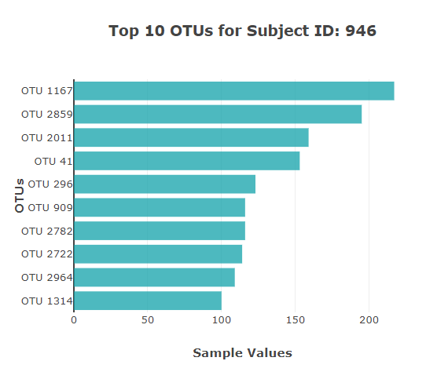
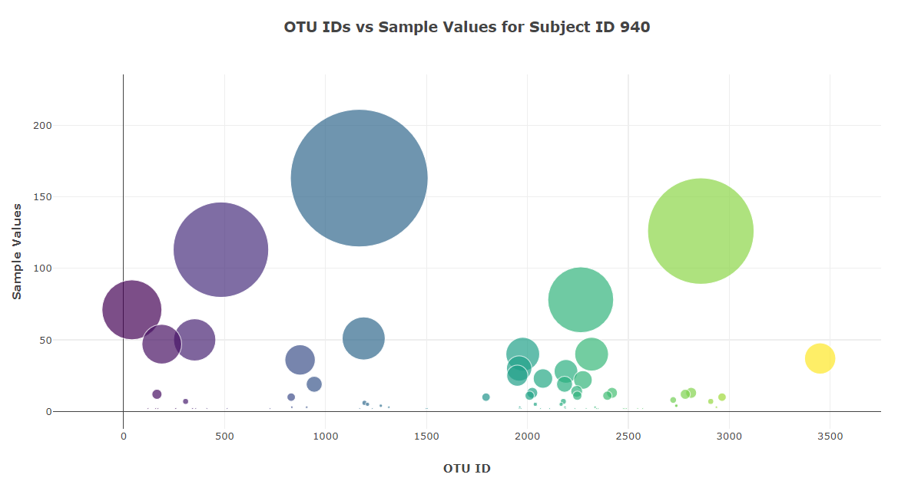
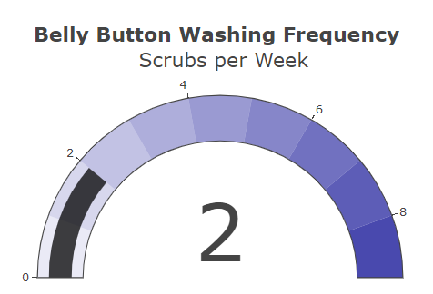
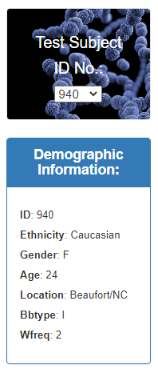

# Belly Button Biodiversity

Thanks for checking out my project's repo! You can visit the website [ HERE ](https://kmcgrath88.github.io/Belly_Button_Biodiversity/) or you can download the repo. You'll be able to observe interactive dashboards on the diversity of microbes in individuals' belly buttons. Also, you'll be able to observe demographic information about the people involved in this study. To learn more about this study, check out: [ Belly Button Biodiversity ](http://robdunnlab.com/projects/belly-button-biodiversity/)  

<!-- TABLE OF CONTENTS -->
## Table of Contents

* [About the Project](#about-the-project)
  * [Built With](#built-with)
* [Project Instructions](#project-instructions)

<!--About the Project-->
## About the Project

By choosing a test subject ID number from the drop down menu, you'll be able to view three interactive charts and demographic information for that subject.  

The first chart is a horizontal bar graph with the top 10 OTUs found in that individual. Here is an example: 
 

The second chart is a bubble chart that displays the OTU IDs and sample values for that individual. Here is an example: 
 

The third chart is a gauge chart that displays belly button washing frequency per week of the individual. Here is an example: 
 

The demographic information provides you with more details about the test subject. Here is an example: 
 

<!--Built With-->
### Built With
This project was built using the following frameworks: 
* Plotly
* JavaScript
* Bootstrap
* HTML
* CSS

<!--Project Instructions-->
## Project Instructions

In this assignment, you will build an interactive dashboard to explore the Belly Button Biodiversity dataset, which catalogs the microbes that colonize human navels. 
The dataset reveals that a small handful of microbial species (also called operational taxonomic units, or OTUs, in the study) were present in more than 70% of people, while the rest were relatively rare.

### Step 1: Plotly

1. Use the D3 library to read in samples.json.

2. Create a horizontal bar chart with a dropdown menu to display the top 10 OTUs found in that individual.

* Use sample_values as the values for the bar chart.
* Use otu_ids as the labels for the bar chart.
* Use otu_labels as the hovertext for the chart.

3. Create a bubble chart that displays each sample.

* Use otu_ids for the x values.
* Use sample_values for the y values.
* Use sample_values for the marker size.
* Use otu_ids for the marker colors.
* Use otu_labels for the text values.

4. Display the sample metadata, i.e., an individual's demographic information.

5. Display each key-value pair from the metadata JSON object somewhere on the page.

### Step 2: Advanced Challenge Assignment (Optional)

The following task is advanced and therefore optional.

* Adapt the Gauge Chart from https://plot.ly/javascript/gauge-charts/ to plot the weekly washing frequency of the individual.
* You will need to modify the example gauge code to account for values ranging from 0 through 9.
* Update the chart whenever a new sample is selected.
